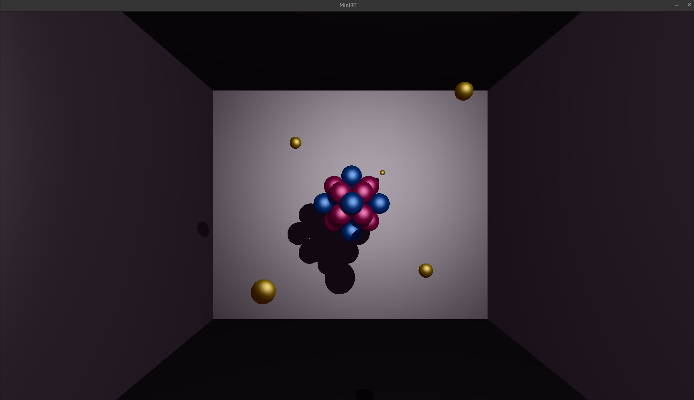
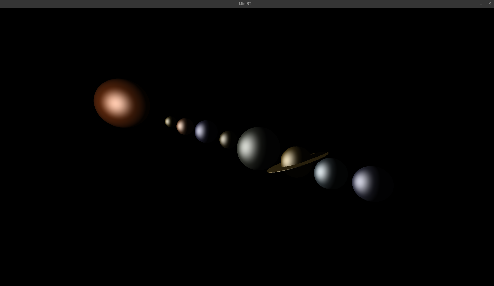
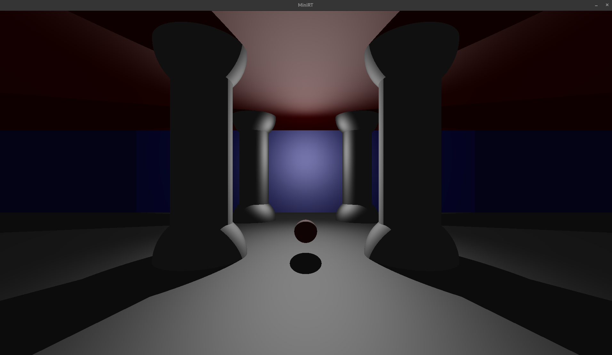
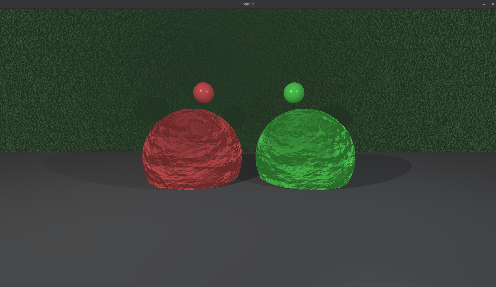
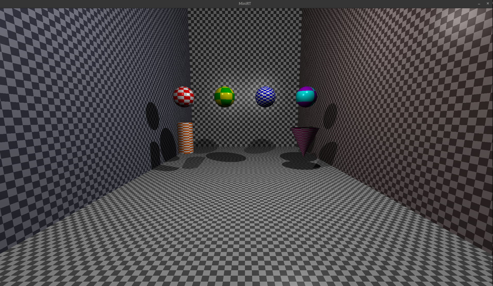
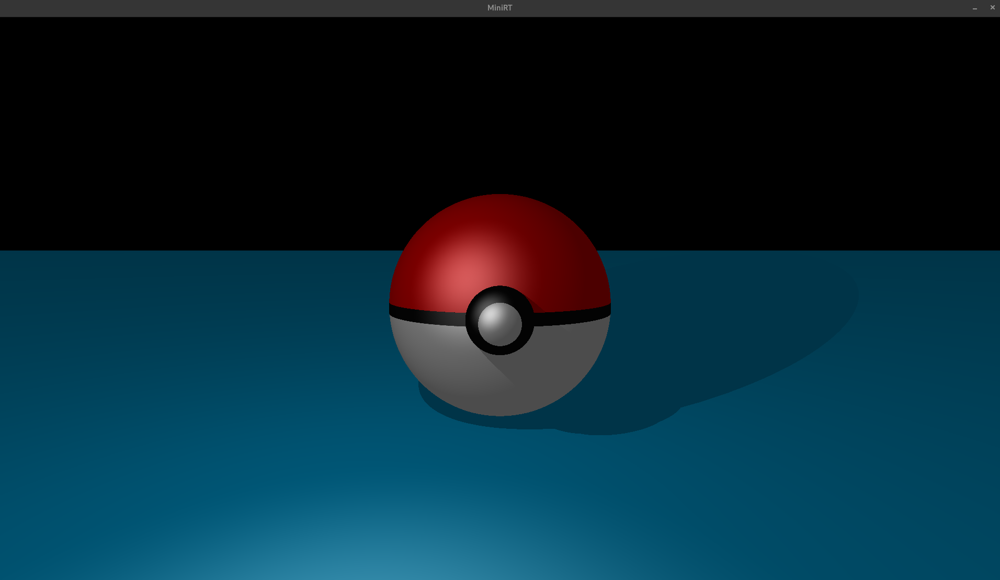
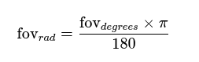
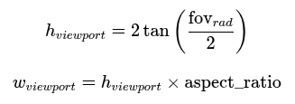

#  📸 MiniRT - Ray Tracing Engine

**A photorealistic ray tracing renderer built from scratch in pure C.** Implements advanced computer graphics algorithms including quadratic-based geometric intersection solvers (sphere, cylinder, cone), Phong illumination model with shadow casting, procedural bump mapping via multi-octave fractal noise, and custom vector mathematics library. Features complete mathematical derivations from linear algebra to rendering equations.

<div align="center">

| Cornell Box | Solar System | Temple Scene |
|-------------|--------------|--------------|
|  |  |  |

| Bump Mapping | Checkerboard | Pokeball |
|--------------|--------------|---------|
|  |  |  |

</div>

---

## 🚀 Quick Start

```bash
git clone https://github.com/siyinkwan/42-MiniRT.git
cd 42-MiniRT
make
./miniRT maps/cornellbox.rt
```
---

## Technical Core

### Rendering Pipeline
```
Ray Generation → Intersection Testing → Shading → Shadow Casting → Pixel Output
     ↓                    ↓                 ↓             ↓              ↓
  Camera        Quadratic Solvers    Phong Model   Recursive Rays   RGB Clamping
  Transform     (at² + bt + c = 0)   (I = Ia+Id+Is)  Shadow Test    Color Mapping
```

## 🧠 Complete Mathematical Documentation

1. [Camera & Ray Generation](#1-camera--ray-generation)
2. [Ray-Object Intersection](#2-ray-object-intersection)
3. [Lighting (Phong Model)](#3-lighting-phong-model)
4. [Bump Mapping](#4-bump-mapping)

---

## 1. Camera & Ray Generation

### 1.1 Camera Coordinate System

Build orthonormal basis vectors (right, up, forward):

**Forward (view direction):**
$$\vec{F} = \text{normalize}(\vec{direction})$$

**Right (horizontal axis):**
$$\vec{R} = \text{normalize}(\vec{up}_{world} \times \vec{F})$$

Special case: if $|\vec{up}_{world} \cdot \vec{F}| > 0.99$, use $\vec{ref} = (1, 0, 0)$

**Up (vertical axis):**
$$\vec{U} = \text{normalize}(\vec{F} \times \vec{R})$$

### 1.2 Ray Generation Through Pixel

**Field of View:**



**Viewport Dimensions:**



**Normalized Device Coordinates (NDC):**
$$u = \frac{x + 0.5}{width}$$
$$v = \frac{y + 0.5}{height}$$

**Viewport Coordinates:**
$$x_{vp} = (u - 0.5) \times w_{viewport}$$
$$y_{vp} = (0.5 - v) \times h_{viewport}$$

**World Position on Viewport:**
$$P_{viewport} = C + \vec{F} + x_{vp} \cdot \vec{R} + y_{vp} \cdot \vec{U}$$

Where $C$ = camera position

**Ray:**
$$\text{Ray} = \{origin: C, \quad direction: \text{normalize}(P_{viewport} - C)\}$$

---

## 2. Ray-Object Intersection

### Ray Equation
$$P(t) = O + t \cdot D$$

Where:
- $O$ = ray origin (camera position or point)
- $D$ = ray direction (normalized)
- $t$ = distance parameter ($t > 0$ for forward intersections)

---

### 2.1 SPHERE Intersection

#### Implicit Equation
$$|P - C|^2 = r^2$$

Where:
- $C$ = sphere center
- $r$ = sphere radius
- $P$ = point on sphere surface

#### Substitution into Ray Equation
$$|O + tD - C|^2 = r^2$$

Let $\vec{oc} = O - C$, then expand:
$$(\vec{oc} + tD) \cdot (\vec{oc} + tD) = r^2$$

#### Quadratic Form: $at^2 + bt + c = 0$

$$a = D \cdot D = 1.0 \quad \text{(when } D \text{ is normalized)}$$

$$b = 2(\vec{oc} \cdot D)$$

$$c = \vec{oc} \cdot \vec{oc} - r^2$$

#### Discriminant
$$\Delta = b^2 - 4ac$$

- $\Delta < 0$: No intersection
- $\Delta = 0$: One intersection (tangent)
- $\Delta > 0$: Two intersections

#### Solution
$$t = \frac{-b \pm \sqrt{\Delta}}{2a}$$

Choose smaller positive $t$ for closest intersection.

#### Normal Vector
$$N = \frac{P - C}{r}$$

---

### 2.2 PLANE Intersection

#### Implicit Equation
$$(P - P_0) \cdot N = 0$$

Where:
- $P_0$ = a point on the plane
- $N$ = plane normal (normalized)

#### Substitution into Ray Equation
$$(O + tD - P_0) \cdot N = 0$$

#### Direct Solution
$$t = \frac{(P_0 - O) \cdot N}{D \cdot N}$$

#### Validity Conditions
- $|D \cdot N| > \epsilon$ (ray not parallel to plane)
- $t > 0$ (forward intersection)

#### Normal Vector
$$N' = \begin{cases} 
N & \text{if } D \cdot N < 0 \\
-N & \text{if } D \cdot N > 0
\end{cases}$$

(Flip normal to face the ray)

---

### 2.3 CYLINDER Intersection (Finite)

#### Infinite Cylinder Equation
$$|(P - C) - [(P - C) \cdot A]A|^2 = r^2$$

Where:
- $C$ = cylinder center
- $A$ = axis direction (normalized)
- $r$ = cylinder radius

#### Variable Substitutions
Let:
- $\vec{oc} = O - C$
- $D' = D - (D \cdot A)A$ (direction perpendicular to axis)
- $\Delta' = \vec{oc} - (\vec{oc} \cdot A)A$ (offset perpendicular to axis)

#### Quadratic Form: $at^2 + bt + c = 0$

$$a = D' \cdot D'$$

$$b = 2(D' \cdot \Delta')$$

$$c = \Delta' \cdot \Delta' - r^2$$

#### Height Constraint
$$-\frac{h}{2} \leq (P - C) \cdot A \leq \frac{h}{2}$$

Where $h$ = cylinder height

#### Cap Intersections
Treat caps as circular planes at:
- Top: $C + \frac{h}{2}A$
- Bottom: $C - \frac{h}{2}A$

Check if hit point is within circle: $|P_{hit} - C_{cap}|_{\perp} \leq r$

#### Normal Vectors

**Body Normal:**
$$N = \frac{(P - C) - \text{proj} \cdot A}{r}$$

Where $\text{proj} = (P - C) \cdot A$

**Cap Normal:**
$$N = \pm A$$

---

### 2.4 CONE Intersection (Finite)

#### Implicit Equation
$$|(P - V) - [(P - V) \cdot A]A|^2 = k^2 \cdot [(P - V) \cdot A]^2$$

Where:
- $V$ = cone apex (tip)
- $A$ = cone axis (normalized)
- $k = \tan(\theta)$, where $\theta$ = half-angle of cone

#### Variable Substitutions
Let:
- $\vec{oc} = O - V$
- $d_{axis} = D \cdot A$
- $o_{axis} = \vec{oc} \cdot A$

#### Quadratic Form: $at^2 + bt + c = 0$

$$a = D \cdot D - (1 + k^2)(d_{axis})^2$$

$$b = 2[D \cdot \vec{oc} - (1 + k^2) \cdot d_{axis} \cdot o_{axis}]$$

$$c = \vec{oc} \cdot \vec{oc} - (1 + k^2)(o_{axis})^2$$

#### Height Constraint
$$0 \leq h = (P - V) \cdot A \leq h_{max}$$

Where $h_{max}$ = cone height

#### Base Intersection
Circular plane at $V + h_{max} \cdot A$ with radius:
$$r_{base} = h_{max} \cdot \tan(\theta)$$

#### Normal Vector (Body)

$$N = \frac{\vec{perp} \cdot h_{max} - A \cdot r_{base}}{\sqrt{r_{base}^2 + h_{max}^2}}$$

Where:
- $\vec{perp}$ = normalized perpendicular component: $\frac{(P - V) - h \cdot A}{|(P - V) - h \cdot A|}$
- $h = (P - V) \cdot A$
- $r_{base} = h_{max} \cdot \tan(\theta)$

---

### 2.5 Summary Table

| Object | Equation Type | Coefficients | Special Handling |
|--------|---------------|--------------|------------------|
| **Sphere** | Quadratic | $a=1, b=2(\vec{oc} \cdot D), c=\|\vec{oc}\|^2-r^2$ | Choose closest $t > 0$ |
| **Plane** | Linear | Direct: $t = \frac{(P_0-O) \cdot N}{D \cdot N}$ | Check parallelism |
| **Cylinder** | Quadratic | Projection perpendicular to axis | Body + 2 caps |
| **Cone** | Quadratic | $(1+k^2)$ factor from $\tan^2(\theta)$ | Body + 1 base cap |

### 2.6 Implementation Notes

1. **Epsilon comparisons**: Use `EPSILON = 1e-6` for floating-point comparisons
2. **Discriminant**: Check $\Delta \geq 0$ before taking square root
3. **Valid t**: Only accept $t > \epsilon$ to avoid self-intersection
4. **Normal orientation**: Flip normals to face the ray (for proper lighting)
5. **Closest intersection**: When multiple solutions exist, choose smallest positive $t$

---

## 3. Lighting (Phong Model)

### Complete Phong Illumination

$$I = I_{ambient} + \sum_{lights} (I_{diffuse} + I_{specular})$$

### 3.1 Ambient Component

$$I_{ambient} = k_a \cdot C_{material} \cdot C_{ambient} \cdot i_{ambient}$$

Where:
- $k_a$ = material ambient coefficient
- $C_{material}$ = material color
- $C_{ambient}$ = ambient light color
- $i_{ambient}$ = ambient light ratio

**Implementation:**
```c
ambient = scene.ambient.color × material.color × scene.ambient.ratio × material.ambient
```

### 3.2 Diffuse Component (Lambertian)

$$I_{diffuse} = k_d \cdot C_{material} \cdot C_{light} \cdot \max(0, N \cdot L) \cdot i_{light}$$

Where:
- $k_d$ = material diffuse coefficient
- $N$ = surface normal (normalized)
- $L$ = light direction (from hit point to light, normalized)
- $i_{light}$ = light brightness

**Lambert's Cosine Law:**
$$\cos(\theta) = N \cdot L$$

**Implementation:**
```c
L = normalize(light.pos - hit.point)
lambert = max(0, N · L)
diffuse = light.color × material.color × material.diffuse × lambert × light.brightness
```

### 3.3 Specular Component (Phong)

$$I_{specular} = k_s \cdot C_{light} \cdot \max(0, R \cdot V)^{\alpha} \cdot i_{light}$$

Where:
- $k_s$ = material specular coefficient
- $R$ = reflected light direction
- $V$ = view direction (from hit point to camera, normalized)
- $\alpha$ = shininess exponent

**Reflection Vector:**
$$R = L - 2(L \cdot N)N$$

Or equivalently: $R = 2(N \cdot L)N - L$

**Implementation:**
```c
V = normalize(camera.position - hit.point)
L = normalize(light.pos - hit.point)
R = reflect(-L, N)  // or: L - 2(L·N)N
specular_factor = pow(max(0, R · V), material.shininess)
specular = light.color × material.specular × specular_factor × light.brightness
```

### 3.4 Shadow Test

Cast shadow ray from hit point to light:
$$Ray_{shadow} = \{origin: P_{hit} + \epsilon N, \quad direction: \text{normalize}(L_{pos} - P_{hit})\}$$

If any object intersects before reaching light → in shadow (skip diffuse/specular)

---

## 4. Bump Mapping

### 4.1 Overview

Perturbs surface normals using procedural noise to simulate surface detail without geometry changes.

### 4.2 UV Mapping

Convert 3D world coordinates to 2D texture coordinates:

**Sphere:**
$$u = 0.5 + \frac{\arctan2(d_z, d_x)}{2\pi}$$
$$v = 0.5 - \frac{\arcsin(d_y)}{\pi}$$
Where $\vec{d} = \text{normalize}(P - C)$

**Plane:**
$$u = P \cdot \vec{T}$$
$$v = P \cdot \vec{B}$$
Where $\vec{T}, \vec{B}$ are tangent and bitangent vectors

**Cylinder:**
$$u = 0.5 + \frac{\arctan2(d_z, d_x)}{2\pi}$$
$$v = (P - C) \cdot A$$
Where $\vec{d}$ is the normalized radial direction

**Cone:** Similar to cylinder

Apply pattern scale: $(u, v) \rightarrow (u \cdot scale, v \cdot scale)$

### 4.3 Hash Function (Pseudo-random)

$$\text{hash}(x, y) = \text{frac}(\sin(x \cdot 127.1 + y \cdot 311.7) \times 43758.5453)$$

Returns value in $[0, 1]$

### 4.4 Smooth Interpolation (Cosine)

$$\text{smooth}(a, b, t) = a(1 - f_t) + bf_t$$

Where:
$$f_t = \frac{1 - \cos(t\pi)}{2}$$

Creates S-curve transition (smoother than linear)

### 4.5 Smooth Noise

Bilinear interpolation of 4 grid corners:
1. Get integer grid coordinates: $(i_x, i_y) = (\lfloor x \rfloor, \lfloor y \rfloor)$
2. Get fractional part: $(f_x, f_y) = (x - i_x, y - i_y)$
3. Interpolate horizontally at both $y$ levels
4. Interpolate vertically

### 4.6 Fractal Turbulence (Multi-octave)

$$\text{bump}(u, v) = \left[\sum_{i=0}^{5} \text{noise}(u \cdot f_i \cdot 5, v \cdot f_i \cdot 5) \cdot a_i\right] - 0.5 \times 20$$

Where:
- $f_i = 2^i$ (frequency: 1, 2, 4, 8, 16, 32)
- $a_i = 0.5^i$ (amplitude: 1, 0.5, 0.25, 0.125, ...)

Each octave adds finer detail at half the amplitude.

### 4.7 Tangent Space

Build orthonormal basis $(T, B, N)$ aligned with surface:

**Tangent:**
$$\vec{T} = \text{normalize}(\vec{up} \times N)$$

If $|\vec{up} \cdot N| > 0.99$, use $\vec{up} = (1, 0, 0)$ instead

**Bitangent:**
$$\vec{B} = N \times \vec{T}$$

### 4.8 Normal Perturbation

$$N' = \text{normalize}\left(N - \frac{\partial h}{\partial u} \vec{T} - \frac{\partial h}{\partial v} \vec{B}\right)$$

**Numerical gradients:**
$$\frac{\partial h}{\partial u} \approx \frac{h(u + \epsilon, v) - h(u, v)}{\epsilon}$$
$$\frac{\partial h}{\partial v} \approx \frac{h(u, v + \epsilon) - h(u, v)}{\epsilon}$$

Where $\epsilon = 10^{-4}$

**Implementation:**
```c
h0 = bump_func(u, v)
hu = (bump_func(u + EPSILON, v) - h0) / EPSILON
hv = (bump_func(u, v + EPSILON) - h0) / EPSILON
N' = normalize(N - hu·T - hv·B)
```
---

## Key Constants

| Constant | Value | Usage |
|----------|-------|-------|
| `EPSILON` | $10^{-6}$ | Floating-point comparisons |
| `PI` | $3.14159265$ | Angle conversions |
| `B_EPSILON` | $10^{-4}$ | Bump mapping gradient step |

---

## 📐 Vector operations reference
[VECTOR_CHEATSHEET.md](VECTOR_CHEATSHEET.md)